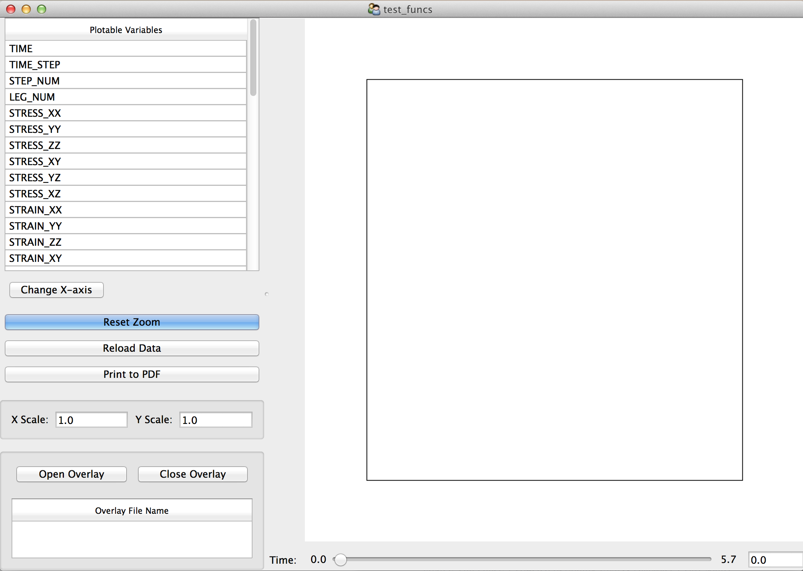

.. _viewer:

Postprocessing Results
######################

.. topic:: See Also

   * :ref:`basic_cli`
   * :ref:`intro_conventions`
   * :ref:`mps`

Overview
========

The Matmodlab.Viewer is an application that

* is developed in `TraitsUI <http://code.enthought.com/projects/traits_ui>`_ and `Chaco <http://code.enthought.com/projects/chaco>`_;
* reads output databases created by the :ref:`mps` and creates 2D plots of the simulation data; and
* is invoked on the command line or as a method of the :ref:`mps`.

Visualizing Results
===================

After completion of a simulation, results can be viewed in one of two ways

* ``MaterialPointSimulator.view()`` method call::

    mps.run()
    mps.view()

* The ``mml`` script::

    $ mml view job.exo

Whatever the method chosen, a `TraitsUI <http://code.enthought.com/projects/traits_ui>`_ window is opened...

.. todo::

   Finish this section
